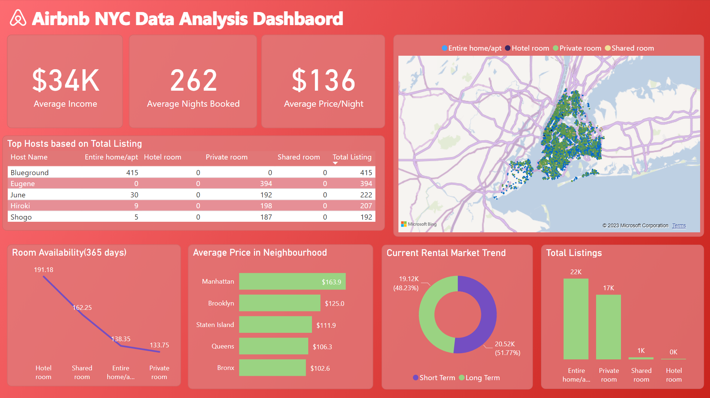

# Airbnb NYC Data Analysis
This project is a comprehensive analysis of Airbnb listings in New York, aiming to uncover trends, derive insights, and create a predictive model for listing prices.

## Project Overview
In this project, we leverage a dataset provided by Inside Airbnb for New Yorks. Our goals are to:
1. Explore and visualize the data to uncover trends and insights
2. Develop a predictive model to predict the prices of listings.

## Files
* **Introduction Notebook :** This notebook provides an introduction and overview of the project, data source and objectives.
* **DataCleaningAndPreparation Notebook:** This notebook contains the exploratory data analysis and visualizations of different aspects of the data
* **EDA Notebook:** This notebook contains exploratory data analysis and visualizations of different aspects of the data.
* **ModelBuilding Notebook:** This notebook includes feature engineering, feature selection,model building, training and evaluation.
* **InsightsCommunication Notebook:** This notebook lays out the key findings from our analysis, discusses their business implications, suggests potential business ideas inspired by these insights, and provides recommendations and future works.

## Key Findings
See the InsightsCommunication Notebook for a detailed discussion of our key findings and their business implications. In brief, we found that:
1. Room Type and Location Matter: The type of room (Entire home/apt, Private room, Shared room) and the borough the listing is in significantly impact the price.
2. More isn't always better: Hosts with multiple listings tend to have lower average prices.
3. Short-Term Rentals Are Pricier: Listings with a high minimum nights requirement (suggesting long-term rentals) tend to have lower prices on a per-night basis.
4. Reviews Don't Affect Price Much: There is not a significant correlation between the number of reviews a listing has and its price.

## Predictive Model
We built and evaluated several models to predict the price of a listing based on its features. The model that performed best in our evaluations was a Random Forest Regressor. The steps on how to build, save, load and use the model can be found in ModelBuilding notebook.

## Power BI Dashboard
We created an interactive dashboard using Power BI to visualize our findings. This dashboard allows users to explore the data themselves and understand the key factors that affect the price of Airbnb listings in New York.

## Getting Started
You will need Python 3 and the following libraries installed on your machine to run the notebooks:
* NumPy
* pandas
* matplotlib
* seaborn
* scikit-learn

To run the notebooks, follow these steps:
1. Clone this repository to your machine.
2. Navigate to the directory in your terminal and run jupyter notebook to launch the Jupyter Notebook app.
3. Open each notebook to view the code and explanations.
